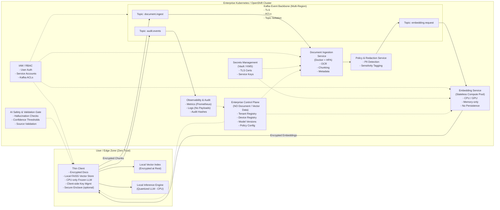

```mermaid
flowchart LR

%% ==================================================
%% User / Edge Zone
%% ==================================================
subgraph EDGE["User / Edge Zone (Zero Trust)"]
    CLIENT["Thin Client
    - Encrypted Docs
    - Local FAISS Vector Store
    - CPU-only Frozen LLM
    - Client-side Key Mgmt
    - Secure Enclave (optional)"]

    LOCAL_INDEX["Local Vector Index
    (Encrypted at Rest)"]

    LOCAL_LLM["Local Inference Engine
    (Quantized LLM - CPU)"]

    CLIENT --> LOCAL_INDEX
    CLIENT --> LOCAL_LLM
end

%% ==================================================
%% Enterprise Kubernetes / OpenShift
%% ==================================================
subgraph K8S["Enterprise Kubernetes / OpenShift Cluster"]

    %% -------------------------------
    %% Kafka Backbone (Multi-Region)
    %% -------------------------------
    subgraph KAFKA_CLUSTER["Kafka Event Backbone (Multi-Region)
    - TLS
    - ACLs
    - Topic Isolation"]
        TOPIC_INGEST["Topic: document.ingest"]
        TOPIC_EMBED["Topic: embedding.request"]
        TOPIC_AUDIT["Topic: audit.events"]
    end

    %% -------------------------------
    %% Core Microservices
    %% -------------------------------
    INGEST_SVC["Document Ingestion Service
    (Docker + HPA)
    - OCR
    - Chunking
    - Metadata"]

    POLICY_SVC["Policy & Redaction Service
    - PII Detection
    - Sensitivity Tagging"]

    EMBED_SVC["Embedding Service
    (Stateless Compute Pool)
    - CPU / GPU
    - Memory-only
    - No Persistence"]

    %% -------------------------------
    %% Governance & Control Plane
    %% -------------------------------
    CONTROL_PLANE["Enterprise Control Plane
    (NO Document / Vector Data)
    - Tenant Registry
    - Device Registry
    - Model Versions
    - Policy Config"]

    IAM["IAM / RBAC
    - User Auth
    - Service Accounts
    - Kafka ACLs"]

    SECRETS["Secrets Management
    (Vault / KMS)
    - TLS Certs
    - Service Keys"]

    %% -------------------------------
    %% Safety & Observability
    %% -------------------------------
    SAFETY_GATE["AI Safety & Validation Gate
    - Hallucination Checks
    - Confidence Thresholds
    - Source Validation"]

    OBSERVABILITY["Observability & Audit
    - Metrics (Prometheus)
    - Logs (No Payloads)
    - Audit Hashes"]

end

%% ==================================================
%% Event-Driven Flows
%% ==================================================

CLIENT -->|Encrypted Chunks| TOPIC_INGEST
TOPIC_INGEST --> INGEST_SVC

INGEST_SVC --> POLICY_SVC
POLICY_SVC --> TOPIC_EMBED

TOPIC_EMBED --> EMBED_SVC
EMBED_SVC -->|Encrypted Embeddings| CLIENT

CLIENT --> TOPIC_AUDIT
TOPIC_AUDIT --> OBSERVABILITY

%% ==================================================
%% Control, Security & Governance
%% ==================================================

IAM -.-> CLIENT
IAM -.-> INGEST_SVC
IAM -.-> EMBED_SVC
IAM -.-> KAFKA_CLUSTER

SECRETS -.-> INGEST_SVC
SECRETS -.-> EMBED_SVC

CONTROL_PLANE -.-> INGEST_SVC
CONTROL_PLANE -.-> EMBED_SVC
CONTROL_PLANE -.-> CLIENT

SAFETY_GATE -.-> CLIENT
OBSERVABILITY -.-> CONTROL_PLANE
```